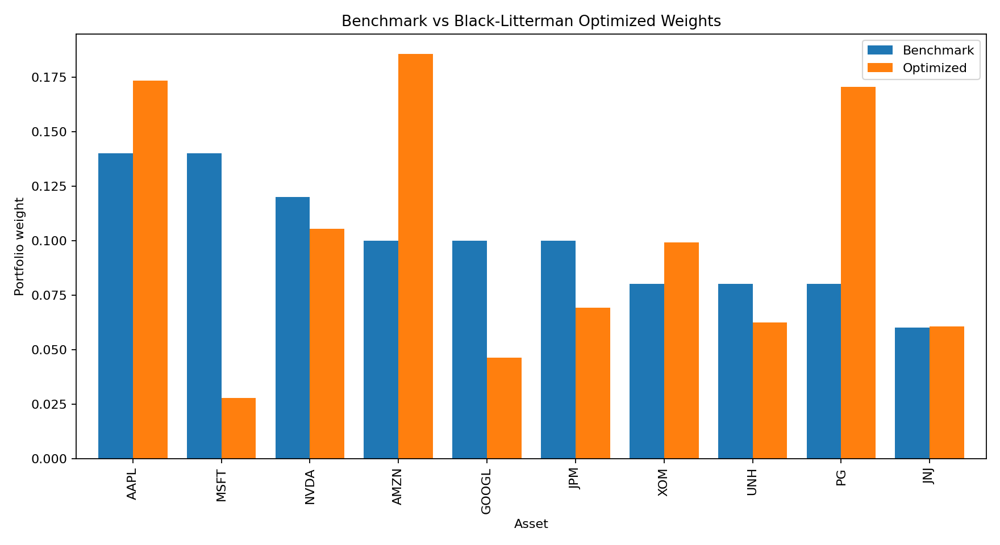
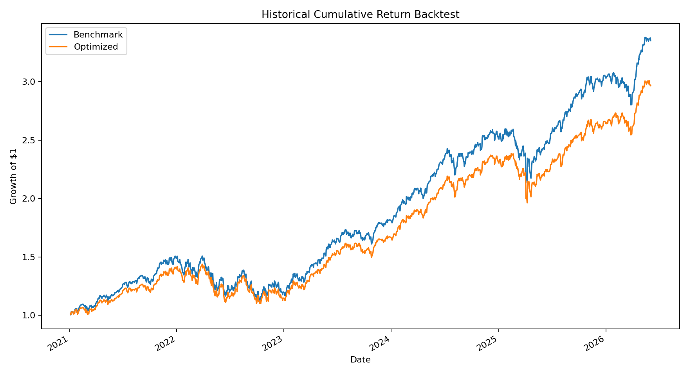
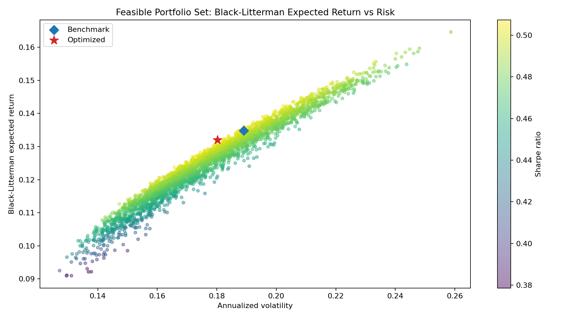
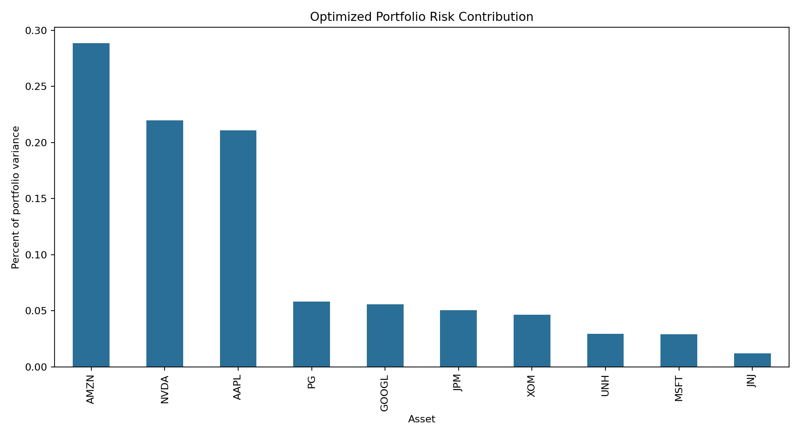

# Black-Litterman Portfolio Optimizer

One-line problem: build a reproducible public-equity portfolio optimizer that starts from benchmark-implied returns, adds analyst views, and produces constrained long-only portfolio weights.

## What I Built

This project implements an original Black-Litterman workflow in Python:

- downloads public daily close prices through `yfinance`
- estimates annualized covariance from historical returns
- uses a benchmark-weight vector to compute implied equilibrium returns
- loads analyst views from a transparent CSV view matrix
- computes posterior expected returns with the Black-Litterman update
- optimizes a constrained long-only max-Sharpe portfolio
- exports tables, charts, and a JSON summary for recruiter review

The implementation is built from public model formulas, not copied from another GitHub repository.

## Tools Used

Python, pandas, NumPy, matplotlib, pytest, yfinance.

## Project Structure

```text
|-- README.md
|-- pyproject.toml
|-- requirements.txt
|-- data/
|   |-- benchmark_weights.csv
|   |-- prices.csv
|   `-- views.csv
|-- outputs/
|   |-- annualized_covariance.csv
|   |-- cumulative_returns.png
|   |-- equilibrium_returns.csv
|   |-- efficient_frontier.png
|   |-- optimized_weights.csv
|   |-- portfolio_metrics.csv
|   |-- posterior_returns.csv
|   |-- risk_contributions.csv
|   |-- risk_contributions.png
|   |-- summary.json
|   |-- utility_weights.csv
|   |-- view_matrix.csv
|   |-- view_uncertainty.csv
|   `-- weights.png
|-- src/
|   `-- portfolio_optimizer/
|-- tests/
|   `-- test_optimizer.py
```

## How To Run

Install dependencies:

```bash
python -m pip install -r requirements.txt
```

Run the full demo:

```bash
python -m src.portfolio_optimizer.run_demo --symbols AAPL,MSFT,NVDA,AMZN,GOOGL,JPM,XOM,UNH,PG,JNJ --start-date 2021-01-01 --end-date 2026-06-03 --benchmark-weights data/benchmark_weights.csv --views data/views.csv --prices-output data/prices.csv --outputs-dir outputs --risk-free-rate 0.04 --tau 0.05 --max-weight 0.25 --iterations 750
```

Run tests:

```bash
pytest -q
```

## Sample Output

The demo exports:

- `outputs/optimized_weights.csv`
- `outputs/posterior_returns.csv`
- `outputs/portfolio_metrics.csv`
- `outputs/weights.png`
- `outputs/cumulative_returns.png`
- `outputs/risk_contributions.csv`
- `outputs/risk_contributions.png`
- `outputs/efficient_frontier.png`
- `outputs/summary.json`

Latest demo run:

```json
{
  "start_date": "2021-01-04",
  "end_date": "2026-06-02",
  "asset_count": 10,
  "observation_count": 1359,
  "benchmark_model_sharpe_ratio": 0.50160058,
  "optimized_model_sharpe_ratio": 0.51054645,
  "top_weight": "AMZN",
  "top_weight_value": 0.18554041,
  "top_risk_contributor": "AMZN",
  "top_risk_contribution": 0.28839842
}
```

Sample optimized weights:

| Asset | Weight |
|---|---:|
| AAPL | 17.33% |
| MSFT | 2.77% |
| NVDA | 10.55% |
| AMZN | 18.55% |
| GOOGL | 4.62% |
| JPM | 6.93% |
| XOM | 9.91% |
| UNH | 6.24% |
| PG | 17.04% |
| JNJ | 6.05% |









## Skills Demonstrated

- Black-Litterman portfolio construction
- equilibrium return estimation
- analyst view matrix design
- covariance estimation
- constrained long-only optimization
- portfolio risk contribution reporting
- efficient-frontier visualization
- reproducible Python data workflow
- finance reporting outputs for portfolio review

## Data And Assumptions

Price data is downloaded through `yfinance`. Benchmark weights and views are transparent demonstration assumptions stored in CSV files. They are not investment advice, trade recommendations, or claims of live portfolio performance.

## Limitations And Future Improvements

- The optimizer uses close-to-close historical covariance and does not model transaction costs or taxes.
- Benchmark weights are a demo strategic allocation, not live market-cap weights.
- Views are sample analyst assumptions designed to demonstrate workflow mechanics.
- Future versions could add factor risk models, turnover constraints, drawdown controls, and live market-cap data.
