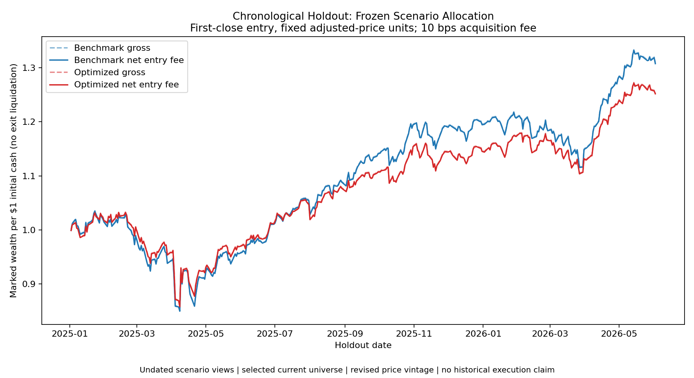
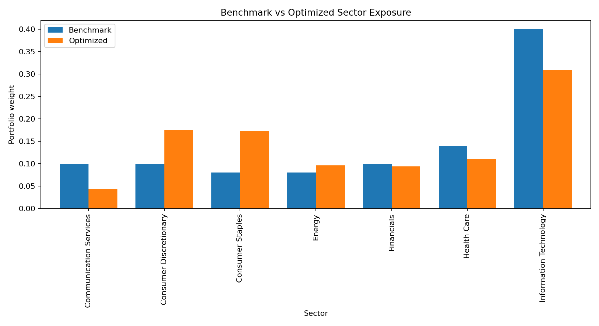

# Black-Litterman Portfolio Optimizer

One-line problem: build a reproducible public-equity portfolio optimizer that starts from benchmark-implied returns, adds analyst views, and produces constrained long-only portfolio weights.

## Workflow

This project implements an original Black-Litterman workflow in Python:

- downloads public daily close prices through `yfinance`
- estimates annualized covariance from historical returns
- uses a benchmark-weight vector to compute implied equilibrium returns
- loads analyst views from a transparent CSV view matrix
- computes posterior expected returns with the Black-Litterman update
- optimizes a constrained long-only max-Sharpe portfolio
- reports sector exposure, risk contribution, and executive summary outputs
- exports tables, charts, and a JSON summary for analytical review
- fits only before a declared cutoff and evaluates a separate chronological scenario holdout
- accounts for acquisition costs, initial funding, fixed holdings and drifting portfolio weights

The implementation is built from public model formulas, not copied from another GitHub repository.

## Tools Used

Python, pandas, NumPy, matplotlib, pytest, yfinance.

## Project Structure

```text
|-- README.md
|-- pyproject.toml
|-- requirements.txt
|-- data/
|   |-- benchmark_weights.csv
|   |-- prices.csv
|   |-- sector_map.csv
|   `-- views.csv
|-- outputs/
|   |-- annualized_covariance.csv
|   |-- cumulative_returns.png
|   |-- equilibrium_returns.csv
|   |-- efficient_frontier.png
|   |-- executive_summary.md
|   |-- holdout/
|   |   |-- manifest.json
|   |   |-- daily_wealth.csv
|   |   |-- entry_trades.csv
|   |   |-- weights.csv
|   |   |-- realized_metrics.csv
|   |   `-- cumulative_wealth.png
|   |-- optimized_weights.csv
|   |-- portfolio_metrics.csv
|   |-- posterior_returns.csv
|   |-- risk_contributions.csv
|   |-- risk_contributions.png
|   |-- sector_exposures.csv
|   |-- sector_exposures.png
|   |-- summary.json
|   |-- utility_weights.csv
|   |-- view_matrix.csv
|   |-- view_uncertainty.csv
|   `-- weights.png
|-- src/
|   `-- portfolio_optimizer/
|-- tests/
|   `-- test_optimizer.py
```

## How To Run

Install dependencies:

```bash
python -m pip install -r requirements.txt
```

Reproduce the published training/holdout scenario:

Use Python 3.11. This command reads the checked-in adjusted-price snapshot without
a market-data request. The requested overall end and training cutoff are exclusive.
The model needs at least 252 training price rows and 20 held-out returns after
the first holdout close. All model inputs and fitted weights use training prices
only. The 2025 cutoff is a single declared scenario, not an optimized split.

```bash
python -m src.portfolio_optimizer.run_demo --symbols AAPL,MSFT,NVDA,AMZN,GOOGL,JPM,XOM,UNH,PG,JNJ --start-date 2021-01-01 --end-date 2026-06-03 --benchmark-weights data/benchmark_weights.csv --sector-map data/sector_map.csv --views data/views.csv --prices-input data/prices.csv --outputs-dir outputs --risk-free-rate 0.04 --tau 0.05 --max-weight 0.25 --iterations 750 --train-end 2025-01-01 --transaction-cost-bps 10
```

For a fresh Yahoo vintage, omit `--prices-input` and supply
`--prices-output data/new_prices.csv --outputs-dir outputs_live`. Responses remain
mutable; cached CSVs use the adjusted-price convention. File hashes identify
bytes, not historical availability or independently reconciled market data.

For the original full-window in-sample diagnostic, omit `--train-end` and use a
different output directory, such as `outputs_in_sample`. A successful in-sample
run reusing a directory removes only this workflow's owned prior holdout files;
it does not leave that pack presented as current. Other user files are retained.

Run tests:

```bash
pytest -q
```

CI runs numerical, chronology, accounting, future-price independence and complete
cached CLI readback checks on Windows and Ubuntu.

## Sample Output

The demo exports:

- `outputs/optimized_weights.csv`
- `outputs/posterior_returns.csv`
- `outputs/portfolio_metrics.csv`
- `outputs/weights.png`
- `outputs/cumulative_returns.png`
- `outputs/risk_contributions.csv`
- `outputs/risk_contributions.png`
- `outputs/efficient_frontier.png`
- `outputs/sector_exposures.csv`
- `outputs/sector_exposures.png`
- `outputs/executive_summary.md`
- `outputs/summary.json`
- `outputs/holdout/manifest.json` with timing, configuration, CSV hashes and limitations
- `outputs/holdout/daily_wealth.csv` with gross/net wealth, entry fees and traded notional
- `outputs/holdout/entry_trades.csv` with the initial acquisition budget and fixed adjusted-price units
- `outputs/holdout/weights.csv` with entry and ending weights
- `outputs/holdout/realized_metrics.csv` and `outputs/holdout/cumulative_wealth.png`

Published scenario results on the frozen snapshot:

- Training: January 4, 2021 through December 31, 2024; 1,005 prices
- Entry: January 2, 2025 close; first modeled return: January 3, 2025
- Holdout ending June 2, 2026; 353 close-to-close return observations

| Holdout measure | Benchmark | Optimized |
|---|---:|---:|
| Gross total return | 30.90% | 25.32% |
| Net total return after entry fee | 30.77% | 25.19% |
| Net CAGR, 252-observation convention | 21.11% | 17.40% |
| Annualized market volatility | 17.02% | 15.77% |
| Max drawdown from initial cash | -17.88% | -16.92% |

The optimized allocation underperformed the benchmark by **5.58 percentage
points net** in this scenario. Training-model Sharpe improvement did not translate
into a higher held-out total return. These are conditional scenario results;
they are not a historical execution record or evidence of prospective alpha.

Training-model summary, separate from the realized holdout above:

```json
{
  "start_date": "2021-01-04",
  "end_date": "2024-12-31",
  "asset_count": 10,
  "observation_count": 1005,
  "benchmark_model_sharpe_ratio": 0.50220502,
  "optimized_model_sharpe_ratio": 0.50788048,
  "top_weight": "AMZN",
  "top_weight_value": 0.17534389,
  "top_risk_contributor": "AMZN",
  "top_risk_contribution": 0.27767144,
  "largest_active_sector": "Consumer Staples",
  "largest_active_sector_weight": 0.09265059
}
```

Training-fitted entry weights:

| Asset | Weight |
|---|---:|
| AAPL | 12.82% |
| MSFT | 8.33% |
| NVDA | 9.67% |
| AMZN | 17.53% |
| GOOGL | 4.34% |
| JPM | 9.40% |
| XOM | 9.63% |
| UNH | 4.59% |
| PG | 17.27% |
| JNJ | 6.42% |







## Methods and Reporting

- Black-Litterman portfolio construction
- equilibrium return estimation
- analyst view matrix design
- covariance estimation
- constrained long-only optimization
- portfolio risk contribution reporting
- sector exposure and active-weight reporting
- efficient-frontier visualization
- executive summary writing for investment committee-style review
- reproducible Python data workflow
- finance reporting outputs for portfolio review

## Data And Assumptions

The top-level `cumulative_returns.png` and historical columns in
`portfolio_metrics.csv` are **training in-sample constant-weight diagnostics**
when `--train-end` is supplied. Without that option, they use the full fitting
window. Model Sharpe ratios describe optimization assumptions, not realized
holdout returns. The separate `holdout/` pack is identified by `summary.json`'s
active holdout reference and its own manifest.

The holdout enters each hypothetical portfolio at its first observed close,
after estimation ends. Its first price return begins at the next close; the
training-to-entry return is excluded. Each portfolio starts with $1 cash. The
default **10 basis point acquisition-fee assumption** charges each acquired
dollar equally; `--transaction-cost-bps 0` disables it. For fee rate `c`, invested
notional is `1/(1+c)` and the fee is `c/(1+c)`, so funding totals exactly $1.
At 10 bps, traded notional is 0.999001 and the fee is 0.000999 per initial dollar.
Turnover here means absolute acquired notional divided by initial cash. There
are no later trades; terminal wealth is marked without assumed liquidation.

Holdings are fixed adjusted-price units, with distributions embedded in the
vendor adjustment convention; this is not a broker share/cash ledger. Weights
drift, so the initial weight cap is not an ongoing rebalancing rule. Net total
return, CAGR and drawdown include the acquisition fee. Market volatility and
the explicitly named gross market Sharpe use subsequent price returns and
exclude the entry fee. The annual risk-free input is a constant assumption.

Views are **undated scenario assumptions** frozen for this run. We cannot show
they were available at the historical cutoff. The selected current universe
lacks point-in-time constituent/delisting records, and the adjusted-price
snapshot is a revised vintage rather than data archived at that cutoff. These
limits remain even though future prices cannot influence model fitting.

Price data is downloaded through `yfinance`. Benchmark weights, sector labels, and views are transparent demonstration assumptions stored in CSV files. They are not investment advice, trade recommendations, or claims of live portfolio performance.

## Limitations And Future Improvements

- The optimizer uses close-to-close historical covariance; the holdout's entry-only fee scenario does not model variable spreads, taxes, liquidity or ongoing fund fees.
- Benchmark weights are a demo strategic allocation, not live market-cap weights.
- Views are sample analyst assumptions designed to demonstrate workflow mechanics.
- Future versions could add factor risk models, turnover constraints, drawdown controls, and live market-cap data.
